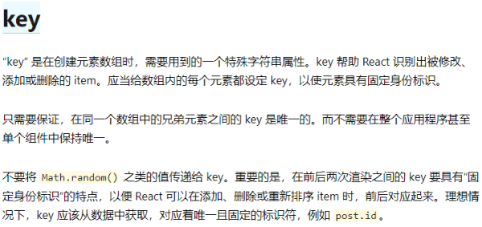
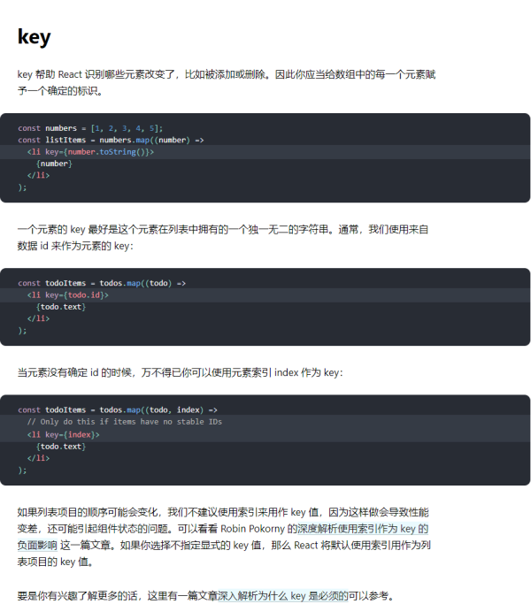
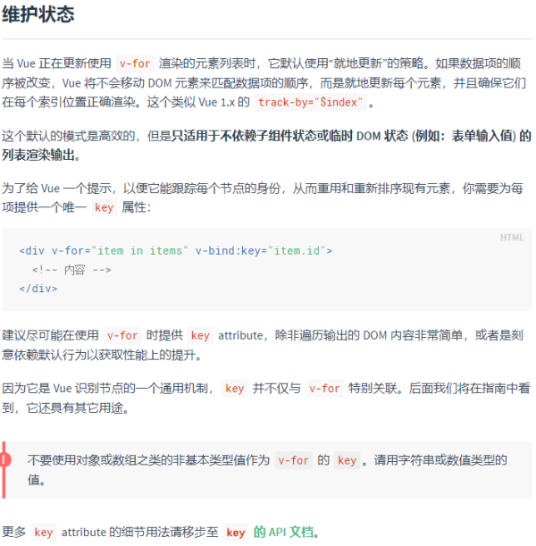
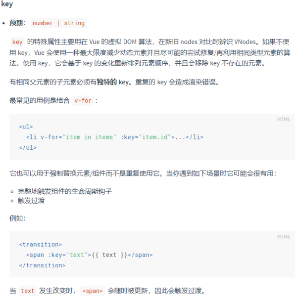

## **前情提要**

> 无论是 React  还是 Vue在渲染列表的时候都建议我们加入key 属性。在实际业务中我们也总是需要渲染后端返回的各种各样的 list  ，并把它们对应显示到UI上。所以就总是要找到 item 中的**唯一标识**来作为我们的 key 值。 

那么问题lei了，我们为啥非得要个 key 呢 。。。

## **渣男版本**

> 使用key可以帮助框架更快更准确的渲染 [微笑]

。。。

虽然没有说错但是很不负责任，你相工作的时候这么说大概会被pass[并回以微笑]

我们不妨先来康康原配们都是怎么说的

## **React原版**



> [来自React官方文档](https://zh-hans.reactjs.org/docs/glossary.html#keys)



> [来自React官方文档](https://zh-hans.reactjs.org/docs/lists-and-keys.html#keys)

## **Vue原版**



> 来自[Vue官方文档](https://cn.vuejs.org/v2/guide/list.html#维护状态)



> [来自Vue官方文档](https://cn.vuejs.org/v2/api/#key)

------

抄书这种脏活累活都交给截图了。。。

好了现在书是抄完了(省的大家翻文档啦)，但是问题好像更多了：

> React和Vue中 key的使用方式看上去是没啥区别，但是他们的内在真的一样吗？ 为什么Vue中提到的就地更新的策略反而性能更好了？  为什么React中就一定要有key值呢，你不给他他居然还默认设成index？  key到底是如何做到提升性能的呢。。。 

我们似乎已经意识到了React和Vue中对key处理的不同，那么就分别深入的看看到底有啥不一样的。。（没错，我说的深入就是到源码里看看） 

------

## Vue中的key

说来说去key啊性能啊什么的其实就是关于底层diff的实现。我们就不多BB直接看最核心的diff算法的源码就行啦。

> [patch.js ---> updateChildren](https://github.com/vuejs/vue/blob/dev/src/core/vdom/patch.js#L424)

```javascript
function updateChildren (parentElm, oldCh, newCh, insertedVnodeQueue, removeOnly) {
    //。。。
    //前面 bla bla 一堆。。。
    //下面是各种情况下Vue采用的不同策略
    while (oldStartIdx <= oldEndIdx && newStartIdx <= newEndIdx) {
      if (isUndef(oldStartVnode)) {
        //bla bla
      } else if (isUndef(oldEndVnode)) {
        //bla bla
      } else if (sameVnode(oldStartVnode, newStartVnode)) {
        //bla bla
      } else if (sameVnode(oldEndVnode, newEndVnode)) {
        //bla bla
      } else if (sameVnode(oldStartVnode, newEndVnode)) { // Vnode moved right
        //bla bla
      } else if (sameVnode(oldEndVnode, newStartVnode)) { // Vnode moved left
        //bla bla
      } else {
        //bla bla bla
        }
        //bla bla
      }
    }
    //bla bla bla
  }
```

我就非常贴心的为你省掉了当前并不需要在意的代码。。。(不用谢我)

你就一下子可以看出来，他一直在用一个sameVnode的函数去对比新旧节点，来走入diff逻辑

 那么，sameVnode长啥样呢，它也在这个文件中

> [patch.js ---> sameNode](https://github.com/vuejs/vue/blob/dev/src/core/vdom/patch.js#L35)

```javascript
function sameVnode (a, b) {
  return (
    a.key === b.key && (
      (
        a.tag === b.tag &&
        a.isComment === b.isComment &&
        isDef(a.data) === isDef(b.data) &&
        sameInputType(a, b)
      ) || (
        isTrue(a.isAsyncPlaceholder) &&
        a.asyncFactory === b.asyncFactory &&
        isUndef(b.asyncFactory.error)
      )
    )
  )
}
```

啊哈，key就在这儿呢。a.key === b.key 

显然 sameVnode这个函数就是用来判断两个节点是否是相同的节点。而在 updateChildren中 ，如果是相同的两个节点，就会走入一些优化的diff流程。

 当然sameVnode还有一些其他的判定条件，但是你可以看到key是一切条件的前置，如果key不一样后面的直接没用了。

所以，这就是Vue里面对key的应用，一个唯一的key值帮助Vue 识别节点，从而使diff逻辑走入设计好的最优解中。 

那么问题来了，如果你不写key呢？

对key的判断就会变成 undefined === undefined那就是true了。 也就是说sameVnode就有可能判定成功。

如果判定为相同的节点的话，Vue就会尽可能的复用以前的节点，也就不会走 创建新的节点，销毁旧的节点这样的流程了。也就是说 他直接用了以前的旧节点。这就是文档中说的就地更新的策略。

那么就解释的通了，为什么Vue在v-for的文档中说这样的策略是高效的，因为你省去了创建，销毁等等一系列的动作。。。

由此也带来了问题，就是文档中指出的

- 完整地触发组件的生命周期钩子
- 触发过渡

所以，也就只适用于简单DOM输出。

至此。。key在Vue中的作用就是这样啦，所以我们也就知道为什么需要key了。 

------

呼。。。。。。。写的好长啊

React的我后面再更新吧，溜了溜了。。。